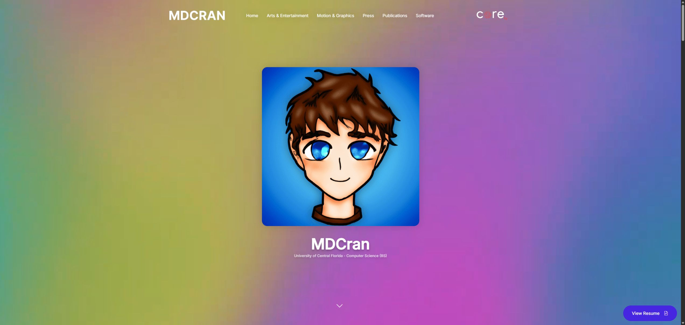
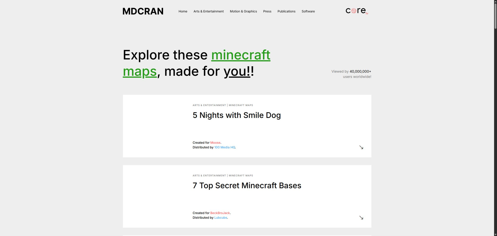

# mdcran-portfolio-legacy

Legacy personal portfolio archive retained for historical reference.

## Framework and tooling

This repository is documented as a focused project archive. See the source tree and package manifests for the exact runtime and development dependencies.

## Preview

A preview image is not included because this repository is an archive or content package rather than a currently deployed public site.

## Attribution

Built and maintained by [MDCran](https://github.com/MDCran).

 

Legacy static portfolio site, captured from [legacy.mdcran.com](https://legacy.mdcran.com/).

## App screenshots

### Home

### Minecraft Maps

